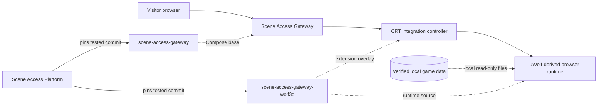

# Scene Access Gateway — Wolf3D extension

[](https://github.com/zipkindev/scene-access-gateway-wolf3d/actions/workflows/ci.yml)
[](LICENSE)
[](https://github.com/zipkindev/scene-access-gateway)
[](#game-data-boundary)
[](https://github.com/zipkindev/scene-access-platform)

An optional browser-runtime extension that brings Wolfenstein 3D and Spear of
Destiny into the interactive CRT presentation of
[Scene Access Gateway](https://github.com/zipkindev/scene-access-gateway).

This repository contains the adapted GPL browser engine, portal controller,
responsive controls, verification manifests, and import tooling. It does
**not** distribute commercial Wolfenstein 3D or Spear of Destiny game data.

Most users should obtain this extension through
[Scene Access Platform](https://github.com/zipkindev/scene-access-platform),
which pins a tested Gateway and extension pair. This repository remains the
correct place to develop and review the GPL runtime, controller, data importer,
and extension-specific tests.

## What the extension adds

- Wolfenstein 3D and Spear of Destiny runtime profiles selected from the
  portal's in-scene game carousel.
- A CRT boot, power-down, and game-switching presentation integrated with the
  authored scene rather than presented as a separate application.
- The release-78 live-framebuffer compositor, 480-line transition, continuous
  CRT filter, pixel-built boot/shutdown labels, synchronized transition audio,
  and server-backed Wolf/Spear score flow.
- Keyboard, mouse, touch, mobile HUD, save, map, and weapon-selection support.
- Embedded scene controls plus a responsive wide/fullscreen mobile mode.
- Scene-aware zoom and pinch behavior that coordinates the game viewport with
  the outer portal camera.
- Exact recognition of supported user-owned datasets by filename, byte length,
  and SHA-256 before installation.
- A read-only Compose mount contract that leaves the main portal independently
  buildable and deployable.

## Relationship to the main project



The extension does not replace or fork the main application. Its Compose file
adds two read-only mounts to the existing backend: the browser runtime and the
CRT controller. If the overlay is omitted, Scene Access Gateway continues to
run normally and its game routes remain unavailable.

## Requirements

- Git
- Node.js 22 or newer for validation and data import
- Docker Engine and Docker Compose v2 to run the combined stack
- A Platform workspace or local checkout of `scene-access-gateway`
- Legally obtained, supported Wolfenstein 3D and/or Spear of Destiny data

## Quick start

Clone the supported Platform workspace:

```sh
git clone --recurse-submodules https://github.com/zipkindev/scene-access-platform.git
cd scene-access-platform
./scripts/test.sh
```

Validate only the extension source when working inside its submodule:

```sh
./wolf3d/scripts/test.sh
```

Import one or both supported datasets from a directory containing your legally
obtained game files:

```sh
./wolf3d/scripts/import-game-data.sh /path/to/owned/game/files WL6
./wolf3d/scripts/import-game-data.sh /path/to/owned/game/files SOD
./wolf3d/scripts/verify-game-data.sh ALL
```

The importer matches filenames case-insensitively, validates the complete
selected dataset before copying anything, and accepts only the byte lengths
and SHA-256 values recorded in `manifests/supported-data.json`. Existing files
are retained only when they pass the same validation.

Start the combined stack from the Platform root:

```sh
./scripts/up.sh
```

Standalone component contributors can still run
`./scripts/smoke-combined.sh /path/to/scene-access-gateway` from this repository.

## Supported data profiles

| Profile | Content | Expected files |
| --- | --- | --- |
| `WL6` | Wolfenstein 3D | `AUDIOHED`, `AUDIOT`, `GAMEMAPS`, `MAPHEAD`, `VGADICT`, `VGAGRAPH`, `VGAHEAD`, and `VSWAP` with `.WL6` extensions |
| `SOD` | Spear of Destiny | The corresponding eight files with `.SOD` extensions |
| `ALL` | Both profiles | Every file from both profiles |

The manifest identifies exact supported data, not merely compatible-looking
filenames. Different releases or modified datasets are rejected rather than
silently loaded.

## Game-data boundary

Imported `.WL*`, `.SOD`, and `.SD*` files are placed under `runtime/` and
ignored by Git. They must not be committed, uploaded as release assets, or
redistributed with this project. The test suite fails if a matching game-data
file becomes tracked.

The source repository therefore remains useful without proprietary content:
it provides the runtime modifications, integration logic, exact compatibility
manifest, and safe import path; each user supplies data they are authorized to
use.

## Source provenance

The browser runtime is based on
[`dibdot/uWolf`](https://github.com/dibdot/uWolf), a dependency-free JavaScript
raycaster distributed under GPL-3.0. This repository was audited against
upstream commit `80571bbde9897881ca2d9ecaf30e81cb308f37bb`:

- nine of twelve JavaScript modules, both favicons, and the runtime GPL license
  remain byte-identical to that upstream revision;
- the remaining runtime files contain the portal, Spear, mobile, save,
  viewport, and presentation adaptations maintained here;
- `integration/future-wolf3d-crt.js` is the Scene Access Gateway controller and
  is released under GPL-3.0 with the rest of this repository.

See [SOURCES.md](SOURCES.md) for the file-level source record and
[NOTICE.md](NOTICE.md) for authorship and modification notices.

## Validation

```sh
./scripts/test.sh
```

The validation checks JavaScript and shell syntax, parses the supported-data
manifest, confirms the root and runtime GPL license files are byte-identical,
rejects obsolete attribution, verifies the exact release-78 source hashes,
exercises its transition contracts, and confirms that no commercial game
dataset is tracked.

To build and smoke-test both repositories together:

```sh
./scripts/smoke-combined.sh ../scene-access-gateway
```

GitHub CI runs the same combined check from clean public checkouts without
commercial game data. When verified local data is present, the script also
checks the exact WL6 route and byte length.

After importing data, run:

```sh
./scripts/verify-game-data.sh WL6
./scripts/verify-game-data.sh SOD
```

## Maintaining your local checkout

Imported game data stays ignored while source fixes follow an ordinary
feature-branch and pull-request workflow. See
[Local development and Git synchronization](docs/LOCAL-DEVELOPMENT.md), or
run `./scripts/sync-branch.sh` after committing a clean feature branch to
rebase it onto current `main`, retest it, and push it safely.

## Repository layout

| Path | Responsibility |
| --- | --- |
| `runtime/` | uWolf-derived browser engine and ignored local game-data target |
| `integration/` | Scene/CRT controller loaded by the main portal |
| `manifests/` | Exact identities for supported user-supplied datasets |
| `scripts/` | Safe import, verification, source-boundary, and combined-stack tests |
| `compose.extension.yaml` | Read-only extension mounts for the main stack |
| `docs/` | Architecture and publication review records |

## Publishing status

Provenance, GPL inheritance, modified files, trademark boundaries, and
commercial-data exclusions are recorded in
[the publishing review](docs/PUBLISHING-REVIEW.md). A clean clone should
contain the engine and tooling but none of the locally imported game files.

## License and trademarks

The repository source is distributed under the
[GNU General Public License version 3](LICENSE). The GPL applies to the source
code in this repository; it does not grant rights to Wolfenstein 3D or Spear
of Destiny game data, artwork, audio, characters, or trademarks.

Wolfenstein 3D, Spear of Destiny, id Software, Bethesda, ZeniMax, Microsoft,
and related names and content belong to their respective owners. This project
is not affiliated with or endorsed by them.
