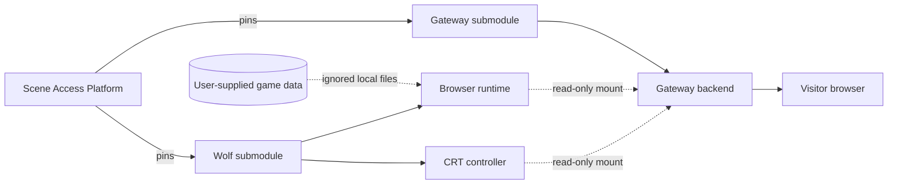

# Extension architecture

Scene Access Gateway loads optional extensions from protected read-only mounts.
This repository supplies two such inputs:

1. `runtime/` is served beneath `/wolf3d/` by the gateway backend.
2. `integration/future-wolf3d-crt.js` controls the in-scene CRT, boot sequence,
   game selection, exit behavior, viewport messaging, and WIDE integration.

The core repository owns the surrounding scene, editor, gateway, and access
workflow. This extension owns the game runtime and its game-specific browser
controller. Commercial datasets remain ignored local runtime inputs.

## Runtime contract

`compose.extension.yaml` adds no public listener and builds no replacement
Gateway image. It extends the existing `backend` service with environment
paths and two read-only mounts. The backend exposes extension routes only when
those mounted inputs are valid and present.

The Platform root exports `SAG_WOLF3D_EXTENSION_DIR` before combining the base
and extension Compose models. Omitting the overlay returns the independently
usable Gateway stack.

## Ownership boundaries

| Owner | Responsibility |
| --- | --- |
| Gateway | Scene, editor, HTTP routes, score persistence, portal camera, and extension contract |
| Wolf extension | GPL runtime, CRT controller, supported-data manifest, importer, and extension tests |
| Local operator | Legally obtained game data and the decision to enable the overlay |
| Platform | Tested component pairing and combined lifecycle commands |
